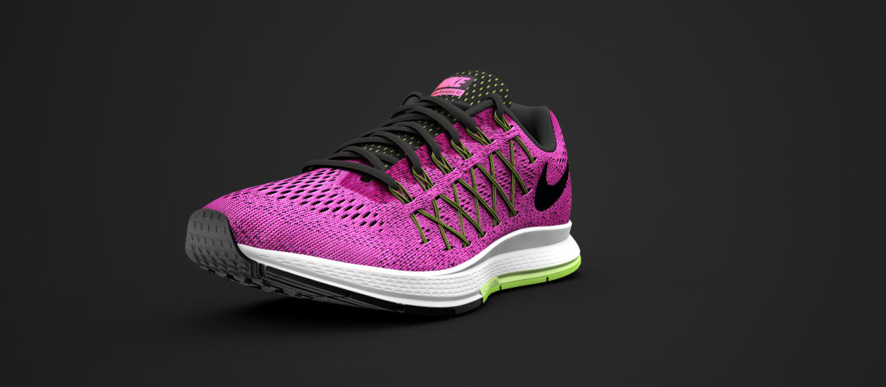

# Image Sequence Explorer
HTML5 image sequence scrubber with time/frame triggered overlays. It's called vidscrubber because I originally thought I was going to use a video. Duh.

View latest build:
[http://rainbows4dinos.github.io/vidscrubber/](http://rainbows4dinos.github.io/vidscrubber/)

## Using 
First, include the required **js** and **css** files into your site. 

### CSS
- `air-zoom-explorer-dependencies.css`
- `air-zoom-explorer.css`

### JS
- `air-zoom-explorer-dependencies.js`
- `air-zoom-explorer-main.js`

### The Markup:
```
<div id="nikeAirZoomExplorer" class="explorer-frame"
  data-frames-dir         = "images/air_zoom_explorer/frames/"
  data-frame-count        = "24"
  data-callouts-dir       = "images/air_zoom_explorer/callouts/"
  data-callout-points-json = "json/air-zoom-explorer-callout-points.json"
  data-lang               = "eng/"
  >
  <div class="explorer-logo-overlay" style="background-image: url(images/air_zoom_explorer/peg32_logo.svg)"></div>
  <div class="explorer-spinner"></div>
  <div id="explorerSlider" class="explorer-controls"></div>
  <ul class="explorer-overlays"></ul>
  <div class="explorer-image-seq-container">
    
  </div>
</div>
```

### Application Options
Most options are passed through the **data atributes** of the markup, with the exeption of an **optional json file** you can load in to define the animation in and out points of the callouts. 

|Data Attr   | Definition|
|:-----------|:----------|
|`data-frames-dir` | Path to directory containing the animation's frames. These must be `.jpg`s.|
|`data-frames-count` | Optional - # of frames in the animation, corrisponding to # of jpgs. Defaults to 24.|
|`data-callouts-dir`| Path to directory containing the callouts. Must be `.svg`s same size as animation frames.|
|`data-callout-point-json`| Optional - Path to a `.json` file defining the in and out points of each callout.|
|`data-lang`| This is the name of the sub-directory containing the callouts. Create new directories for new languages.|

#### JSON
The json is very simple: Just an array of objects corrisponding to the number of callouts, each object defining an **in point** and **out point** in frames. 
```
{

  "in": "5",

  "out": "8"

},
```

### Markup Options
There are two blocks in the markup that you'll probably want to edit: 

The logo overlay (class `.explorer-logo-overlay`) and the default `img` (class `explorer-default-image`.) 

The logo overlay is a **div with a svg background**. Make this svg whatever you like, but make sure it's the **same width and height as the callouts and frames (800 x 350)** or else things won't line up. 

The default `img` is the **image that appears underneath everything** while the app is spinning up. This can also serve as a **fallback for older browsers**. Once the app spins up this tag's `src` attribute will be swapped out for the different frames of the animation. 

### Initializing The App
Pretty straight forward. Just make sure JQuery is loaded and call:
```
var airZoomExplorer = new transport.NikeAirZoomExplorer($('#nikeAirZoomExplorer'));
```
Of course, you can name that variable whatever you like, but you get the idea. All we're doing is passing the markup wrapper `id` (`#nikeAirZoomExplorer`) into a new instance of `transport.NikeAirZoomExplorer`. Easy Peasy. There's an example of how you might check for basic compatability in the `index.html` provided. 

## Compatibility:

| Browser       | Version      |
|:--------------|:-------------|
| IE            | 9         |
| Firefox       | 38        |
| Chrome        | 31        |
| Safari        | 7.1       |
| Opera         | 30        |
| iOS Safari    | 7.1       |
| Android       | 4.1       |
| Android Chrome| 42        |
| Opera Mini    | Pfft…     |


